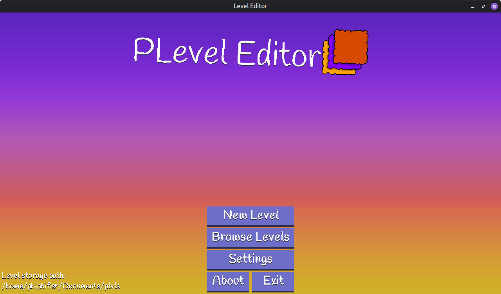
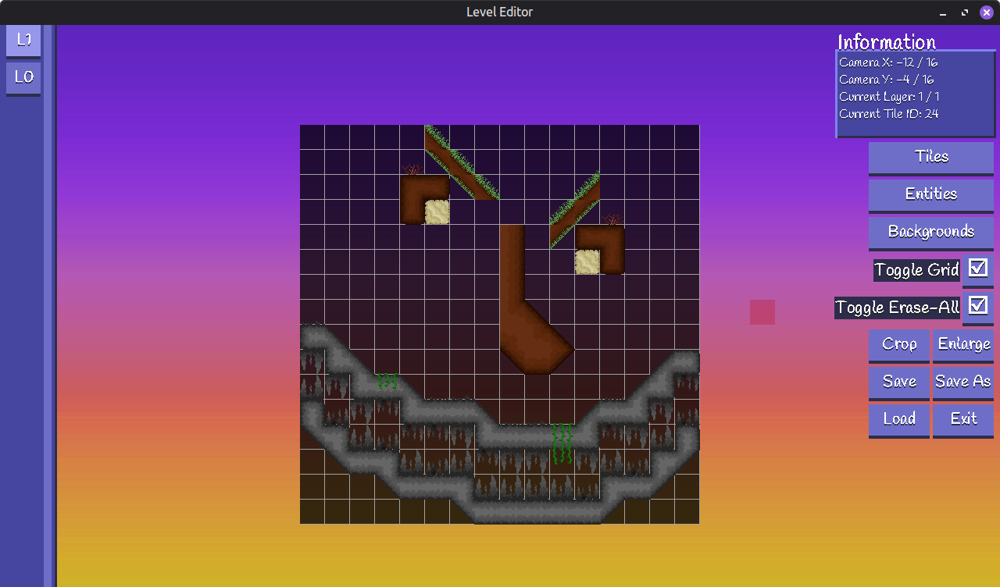
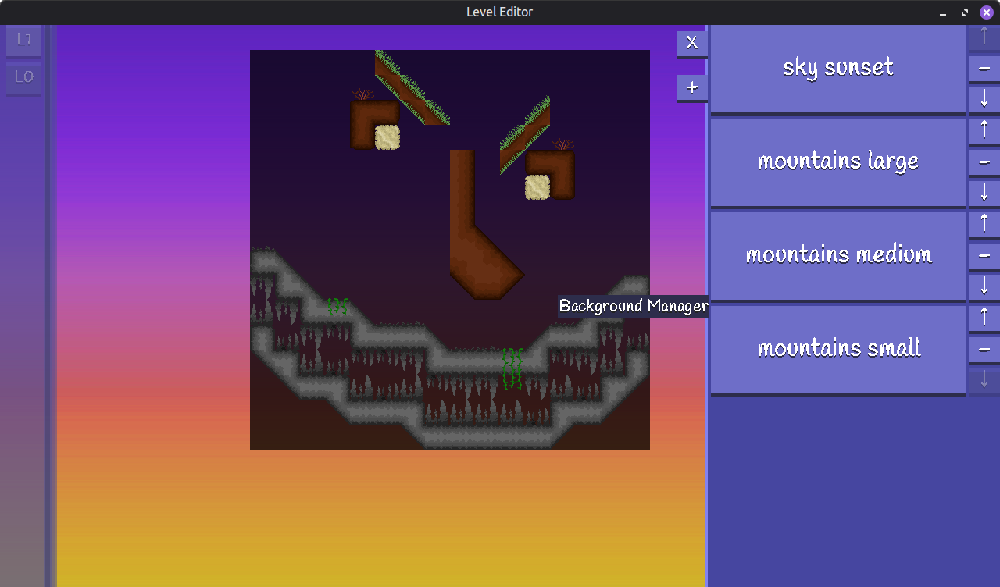
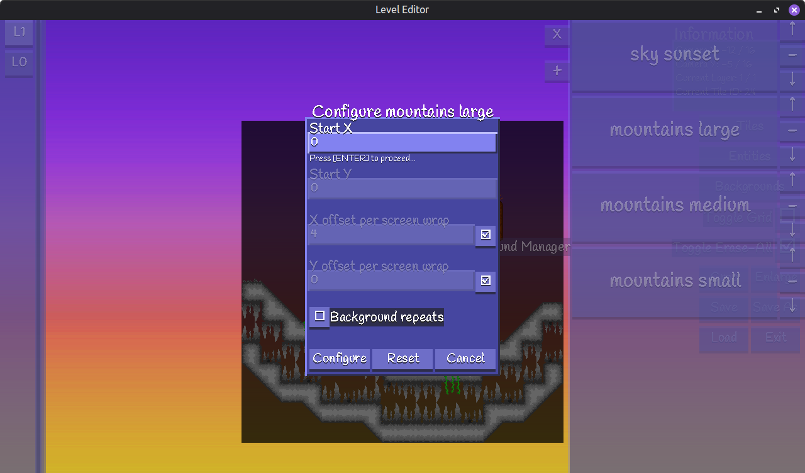
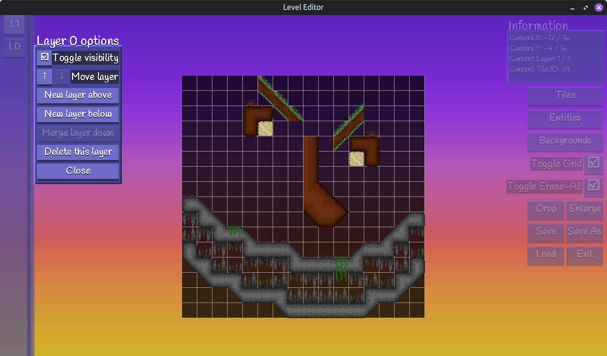

Indev  
To compile, cd to the folder containing the p_level_editor folder, and run the following command:  
javac p_level_editor/*/*.java  

Should be compatible with java 8 and above. Although I've only tested with jdk25

To run, while still in the p_level_editor folder, run this command:
java main.PLevelEditor

This is my custom level editor! It isn't quite finished yet, but all base functionality is here. If allows for creating 2D tile based levels with layer support. It Includes basic entity placement, which will place instances of EntityDataHolder. Entity data holders contain x/y coordinates, an id, and an additional number for different states. The ability to change the additional state number is not yet implemented. Backgrounds are handled through the background manager, and follow a similar philosophy to entties, allowing for embedding background data including id, x, y, x and y offsets per screen wrap in pixels, and a boolean for whether or not the background is tiled/repeats. Right clicking the layer buttons on the left side of the editor provides additional options, such as toggle visibility, shift layer up/down, insert new layers, and delete functions. The entire level can be cropped to only be as large as it needs to be, or enlarged with a changeable point of origin if you need more space.  

The editor is for creating fixed size levels, and populating them with entities and backgrounds. Backgrounds can't be previewed in the editor, and entities take on a vague shape. The idea is that the editor remains agnostic to whatever game it's creating levels for. For quick testing, the intention is to set the save/load folder to whatever game you want to modify levels for. This will include them in the browse levels menu, as well as allow saving directly to the games source folder without having to move files around. Most actions are handled through clicking UI, but camera movement is done by using WASD.

Swapping out different tilesets is a planned feature, but not yet included.  

The ability to drag a selection box on the tile select menu for placing chunks of tiles with a single click is also planned.  

The abality to quickly crop a single layer and set the resulting chunk of tiles as the cursor placement tiles is also planned.  

Main method is located at main.PLevelEditor  

If you compile and run this, it will create a hidden folder in your home directory named ".plvleditor"  

For UI, the main classes of interest are probably Button, ButtonListener, Menu, MenuStringInputField, and StringInputFieldListener. Most other menus follow a pretty similar design, defining size, position, buttons, and interacting with other helper classes, mostly from the level package.  

For actual level modification, the main classes of interest are MenuEditorTools, MenuLayerSelect, MenuLayerOptions, and anything in the level package.  

This is just a hobby project of mine. I'm a self taught java programmer, and this project has been huge in helping me learn more about writing java software. With that said, there's bound to be a lot of crust. lol
